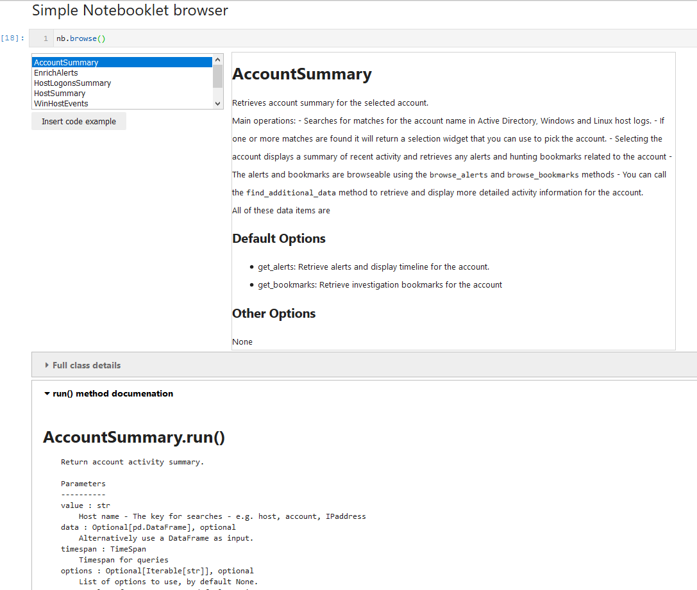

.. msticnb documentation master file, created by
   sphinx-quickstart on Tue Aug 11 20:08:15 2020.
   You can adapt this file completely to your liking, but it should at least
   contain the root `toctree` directive.

msticnb - MSTIC Notebooklets
============================

msticnb is a companion package to
`msticpy <https://msticpy.readthedocs.io/en/latest/>`_. It is designed to
be used in Jupyter notebooks by security operations engineers and analysts,
to give them quick access to
common notebook patterns such as retrieving summary information about
a host or IP address.

         details of the user documentation for the selected notebooklet.
   :width: 5in

Each notebooklet is equivalent to multiple cells and many lines of code
in a traditional notebook. You can import and run a notebooklet with two
lines of code (or even 1 line, if you are impatient). Typically, the input
parameters to a notebooklet will be an identifier (e.g. a host name) and
a time range (over which to query data). Some notebooklets (primarily
packaged analytics) will take a pandas DataFrame as input.

.. code:: ipython3

   host_summary = nb.nblts.azsent.host.HostSummary()
   host_sum_rslt = host_summary.run(value="Msticalertswin1", timespan=time_span)

You can create your own notebooklets and use them in the same framework
as the ones already in the package.

Read on to find out more about using and creating notebooklets.

Introduction and Usage
----------------------

.. toctree::
   :maxdepth: 2

   notebooklets_summary

Notebooklet details
-------------------

.. toctree::
   :maxdepth: 4

   nb_doc_details

Creating Notebooklets
---------------------

.. toctree::
   :maxdepth: 2

   creatingnotebooklets

API
---

.. toctree::
   :maxdepth: 3

   msticnb-api

Indices and tables
==================

* :ref:`genindex`
* :ref:`modindex`
* :ref:`search`
