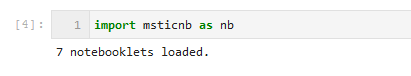
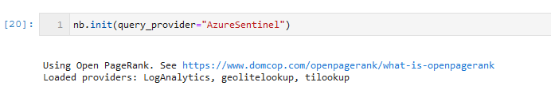

Notebooklets
============

What are notebooklets?
----------------------

Notebooklets are collections of notebook cells that implement some
useful reusable sequence. They are extensions of, and build upon the
msticpy package and are design to streamline authoring of Jupyter
notebooks for CyberSec hunters and investigators. The goal of
notebooklets is to replace repetitive and lengthy boilerplate code in
notebooks for common operations.

Some examples are:

- Get a host summary for a named host (IP address, cloud registration
  information, recent alerts)
- Get account activity for an account (host and cloud logons and
  failures, summary of recent activity)
- Triage alerts with Threat Intel data (prioritize your alerts by
  correlating with Threat intel sources)

Intended Audience
-----------------
- Cyber security investigators and hunters using Jupyter notebooks for their work
- Security Ops Center (SOC) engineers/SecDevOps building reusable notebooks for
  SOC analysts

Why did we create notebooklets?
-------------------------------

- Notebook code can quickly become complex and lengthy:

  - obscures the information you are trying to display
  - can be intimidating to non-developers

- Code in notebook code cells is not easily re-useable:

  - You can copy and paste but how do you sync changes back to
    the original notebook?
  - Difficult to discover code snippets in notebooks

- Notebook code is often fragile:

  - Often not parameterized or modular
  - Code blocks are frequently dependent on global values assigned
    earlier
  - Output data is not in any standard format
  - Difficult to test

Why aren't these part of msticpy?
---------------------------------
- Msticpy aims to be platform-independent, whereas most if not all notebooklets
  assume a data schema that is specific to their data provider/SIEM.
- Msticpy is mostly for discrete functions such as data acquisition, analysis
  and visualization. Msticnb implements common SOC scenarios using this functionality.

Traditional Notebook vs. one using a Notebooklets
-------------------------------------------------

The notebook on the left is using mostly inline code (occupying more
than 50% of the notebook). The one on the right is using a single
notebooklet with only 3 or 4 lines of code.

.. figure:: _static/NBComparison.png
   :alt: Comparing a standard notebook with one using a notebooklet.
         The standard notebook on the left can require large amounts of code.
         The notebook on the right uses just 3 lines of code.
   :width: 3 in

Characteristics of Notebooklets
-------------------------------

- They have one or small number of entry points/methods (typically a
  "run" method)
- They are parametrizable (e.g. you can supply hostname, IP Address,
  time range, etc.) and they may have runtime options to allow to
  skip unwanted processing or include optional processing
- They can query, process or visualize data (or any combination)
- They return a package of results that can be used later in the
  notebook
- The code can be imported into a notebook cell to be modified, if
  needed.

Limitations
~~~~~~~~~~~

- They are normally specific to a data backend/SIEM since the data
  schema and layout varies between SIEM vendors.
- Notebooklet code layout is typically more complex than standard
  notebook code

Using Notebooklets
==================

For a more detailed explanation of these steps and illustration of other
features see the
`Notebooklets notebook <https://github.com/microsoft/msticnb/blob/master/docs/notebooks/NotebookletsDemo.ipynb>`_

Install the Package
-------------------

.. code::

   pip install msticnb

 
Import and initialize
---------------------

 
The init method loads data drivers and data providers relevant to the
the chosen data platform.

         nb.init("AzureSentinel")
   :width: 6in

Pick a notebooklet to use
-------------------------

You can pick a notebooklet from the commandline, using autocompletion.
You can also search for a notebooklet using keywords and text from the
notebooklet name and documentation.

The easiest way is using the nb.browse() method. This lists all of the
available notebooklets and displays documentation, usage information
and sample code snippet for each.

.. figure:: _static/msticnb-browser.png
   :alt: Notebooklet browser showing list of notebooklets and some
         details of the user documentation for the selected notebooklet.
   :width: 5in

Instantiate the notebooklet and execute "run"
---------------------------------------------

Notebooklets usually have a single ``run`` method, which is the entry point
for the notebooklet. A notebooklet might have additional methods to do
further drill-down, data retrieval, visualization or other operations
once the run method has completed. Run typically requires parameters such
as a host or account identifier and a time range over which to perform
the operations.

.. figure:: _static/msticnb-run-cell.png
   :alt: Python code cell showing the creation of a notebooklet instance
         from the WinHostevents notebooklet class. The notebooklet "run"
         method is called with parameters supplying the name of the host
         and a time range.
   :width: 6in

The notebooklet displays output directly to the notebook (although this
can be suppressed) - showing text, data tables and visualizations. This
data is all saved to a Results object. The data items are simple properties
of this results object, for example, DataFrames, plots, or simple Python
dictionaries. You can access these individually and you can just display
the results object using IPython display() or just typing its name into
and emtpy cell and running the cell.

.. figure:: _static/msticnb-run.png
   :alt: The notebooklet displays output directly to th notebook.
         The output includes styled tables, text headings and descriptions
         and interactive timeline visualizations.
   :width: 6in

View extended help for a notebooklet
------------------------------------

You can access detailed documentation from any notebooklet class or
instance using the show_help() method. This help includes a high-level
description and usage information (parameters, available methods, options).
It also describes the major output sections that will be displayed and the
the contents of the return results.

.. note:: the contents of this help are also displayed in the noteboolet
   browser shown earlier.

.. figure:: _static/msticnb-help.png
   :alt: The notebooklet help displays a description, parameter and other
         usage information and available methods. It also describes the
         major output sections and the contents of the return results
   :width: 5in

Current Notebooklets
====================

AccountSummary
--------------

Retrieves account summary for the selected account.

Main operations:

- Searches for matches for the account name in Active Directory,
  Windows and Linux host logs.
- If one or more matches are found it will return a selection widget
  that you can use to pick the account.
- Selecting the account displays a summary of recent activity and
  retrieves any alerts and hunting bookmarks related to the account
- The alerts and bookmarks are browseable using the browse_alerts and
  browse_bookmarks methods
- You can call the find_additional_data method to retrieve and display
  more detailed activity information for the account.

 

EnrichAlerts
------------

Alert Enrichment Notebooklet Class.

Enriches Azure Sentinel alerts with Threat Intelligence data.

 

HostLogonsSummary
-----------------

Host Logons Summary Notebooket class.

Queries and displays information about logons to a host including:

-  Summary of sucessfull logons

-  Visualizations of logon event times

-  Geolocation of remote logon sources

-  Visualizations of various logon elements depending on host type

-  Data on users with failed and sucessful logons

 

HostSummary
-----------

HostSummary Notebooklet class.

Queries and displays information about a host including:

-  IP address assignment

-  Related alerts

-  Related hunting/investigation bookmarks

-  Azure subscription/resource data.

 

WinHostEvents
-------------

Windows host Security Events Notebooklet class.

Queries and displays Windows Security Events including:

-  All security events summary

-  Extracting and displaying account management events

-  Account management event timeline

-  Optionally parsing packed event data into DataFrame columns

Process (4688) and Account Logon (4624, 4625) are not included in the
event types processed by this module.

 

NetworkFlowSummary
------------------

Network Flow Summary Notebooklet class.

Queries network data and plots time lines for network traffic to/from a
host or IP address.

-  Plot flows events by protocol and direction

-  Plot flow count by protocol

-  Display flow summary table

-  Display flow summary by ASN

-  Display results on map

 

TemplateNB
----------

Template Notebooklet class.

A code template for creating additional notebooklets.

 
See Also
--------

`msticpy documentation <https://msticpy.readthedocs.io/en/latest/>`_
